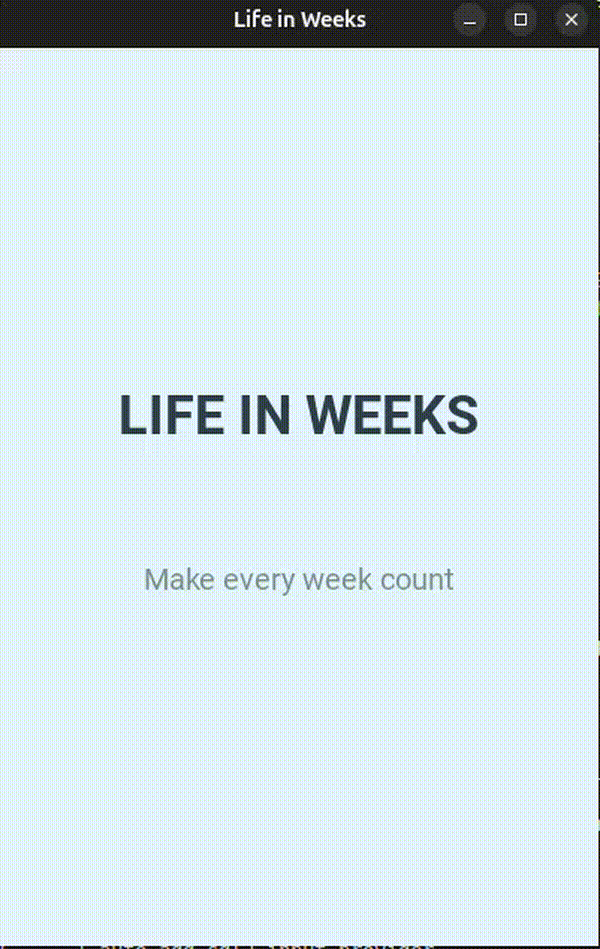

# Memento-Mori

**A small, thoughtful Kivy app to visualize the time you've lived and the time left, with inspirational quotes.**



---

## Table of Contents

* [About](#about)
* [Project Story](#project-story)
* [Features](#features)
* [Installation](#installation)
* [Usage](#usage)
* [Quotes](#quotes)
* [Contributing](#contributing)
* [License](#license)

---

## About

*Memento-Mori* is a simple Python/Kivy app that calculates the approximate number of weeks you have lived and how many may remain based on a typical life expectancy. It combines a visualization of life in weeks with carefully selected inspirational quotes, encouraging reflection on the passage of time.

The app gently reminds users to make every week count.

---

## Project Story

Life is fleeting, and sometimes we forget just how precious every moment is. *Memento-Mori* was born from the desire to pause, reflect, and inspire mindfulness about how we spend our time.

By visualizing your life in weeks and pairing it with inspirational quotes, the app provides a small but meaningful reminder: each week matters, and life is a journey meant to be lived fully—whether you're starting out, enjoying your golden years, or reflecting on a life well lived.

---

## Features

* Modern, minimal, and animated UI using Kivy.
* Fade-in and float animations for screens and content.
* Input your age and calculate weeks lived and remaining.
* Inspirational quotes tailored to different life stages:

  * Young adults
  * Seniors (60+)
  * Those exceeding typical life expectancy
* Restart functionality to input a different age and reflect again.
* Demo video/GIF preview in the repository.

---

## Installation

1. **Clone the repository**

```bash
git clone https://github.com/VasilisKokotakis/Memento-Mori.git
cd Memento-Mori
```

2. **Install dependencies**

```bash
pip install kivy
```

3. **Run the app**

```bash
python main.py
```

> The app is designed for desktop but can be adapted for mobile via Kivy's build tools.

---

## Usage

1. Launch the app.
2. Enter your age in years.
3. View the number of weeks you’ve lived and your remaining weeks.
4. Read a personalized inspirational quote based on your stage in life.
5. Press "Start Over" to reflect again with a different age.

---

## Quotes

* General inspirational quotes for all ages.
* Special quotes for seniors (60+).
* Wisdom quotes for those who have reached or exceeded life expectancy.

> Quotes are randomly selected each time the result screen is displayed.

---

## Contributing

Contributions are welcome!

* Add new quotes
* Improve UI animations
* Add mobile support

Please submit pull requests or open issues with suggestions.

---

## License

This project is licensed under the **MIT License** – see the [LICENSE](LICENSE) file for details.

